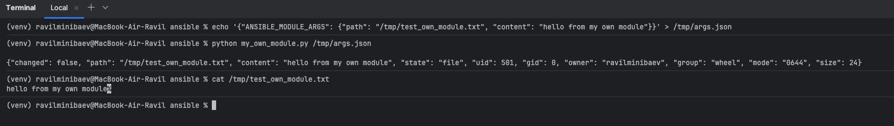
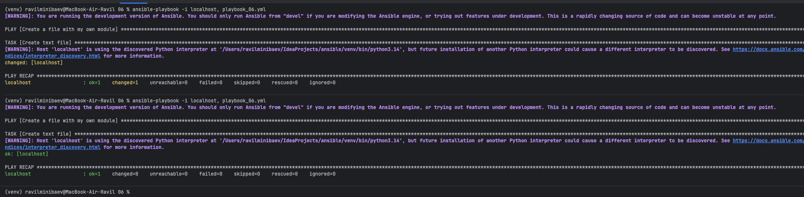
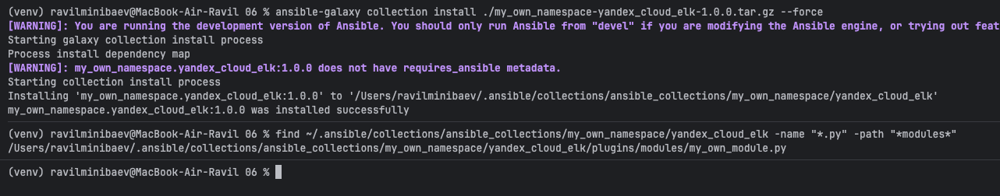
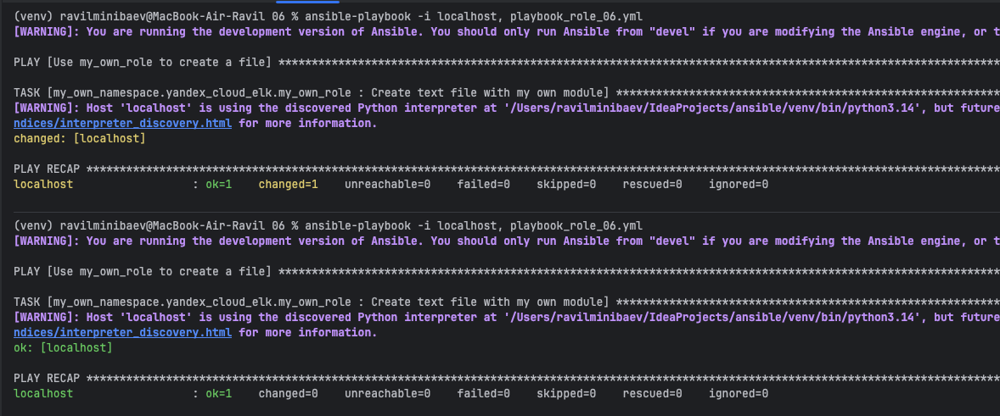

my_own_collection: https://github.com/Ravvka/my_own_collection  
archive: [my_own_namespace-yandex_cloud_elk-1.0.0.tar.gz](my_own_namespace-yandex_cloud_elk-1.0.0.tar.gz)  

# TASK-04

# TASK-06

# TASK-15

# TASK-16
