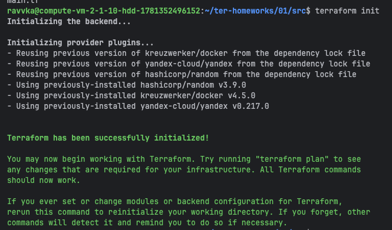
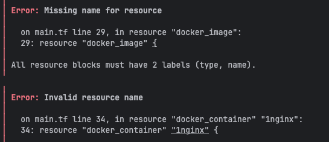
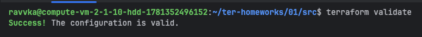
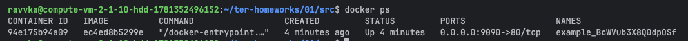
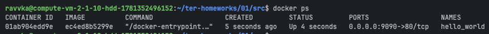
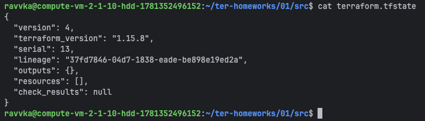

# TASK-0


# TASK-1
1.    


2. креды необходимо хранить в `personal.auto.tfvars`
3. "result": "BcWVub3X8Q0dpOSf"
4. 

- не указано имя эекземпляра ресурса `docker_image`
- опечатка в имени контейнера `nginx`
- ошибки в строке получения рандомного пароля: `_FAKE`, `resulT` с заглавной T


5.    
```json
resource "docker_image" "nginx" {
  name         = "nginx:latest"
  keep_locally = true
}
    
resource "docker_container" "nginx" {
  image = docker_image.nginx.image_id
  name  = "example_${random_password.random_string.result}"
    
  ports {
    internal = 80
    external = 9090
  }
}
```

6. опасность `-auto-approve`: 
- применение без контроля изменений
- вероятное несовпадение версий при командной работе (если применяется не в составе ci/cd)
* применение допустимо при локальной и изолированной разработке, когда ошибки не повлияют на работу


7.    

8. `keep_locally` если выставлено true - образ не будет удалён при операции destroy
```json
resource "docker_image" "nginx" {
  name         = "nginx:latest"
  keep_locally = true
}
```