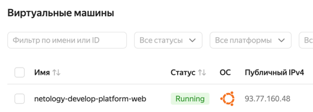
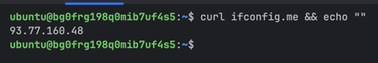
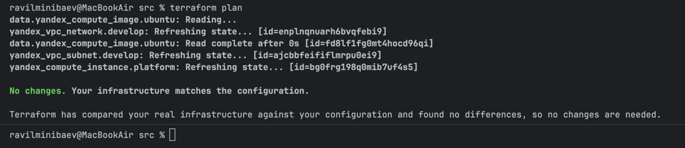
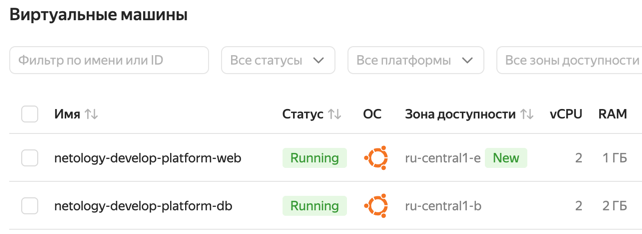

# TASK-1
4. Исправления:
   1. platform_id: "standart-v4"  -> "standard-v3" (v4 не существует)
   2. изменены настройки ядер и их доступности под v3
6. 
   1. core_fraction отвечает за процент доступности ядер (5%, 20%, 50%, 100%)
   2. preemptible отвечает за свойство "Непрерывности" работы ВМ. если true - может автоматически отключиться при простое и сэкономить

   

# TASK-2
1. семейство ubuntu заменил строкой, а для платформы создал переменную типа object
2. done
3. 

# TASK-3

# TASK-4
