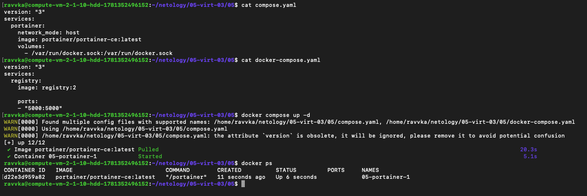
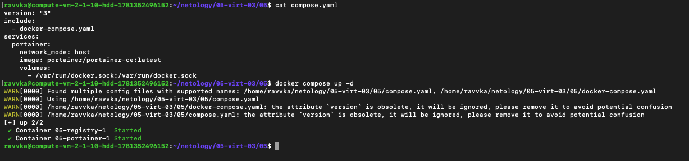
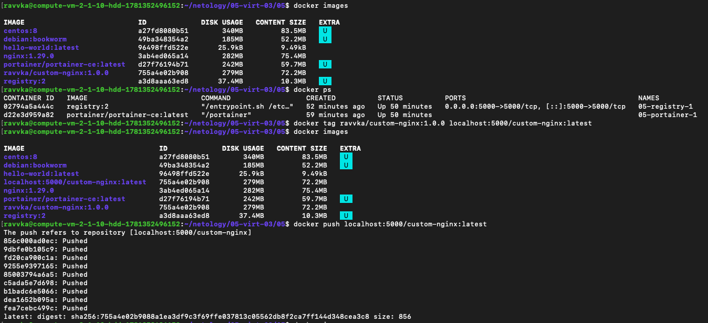
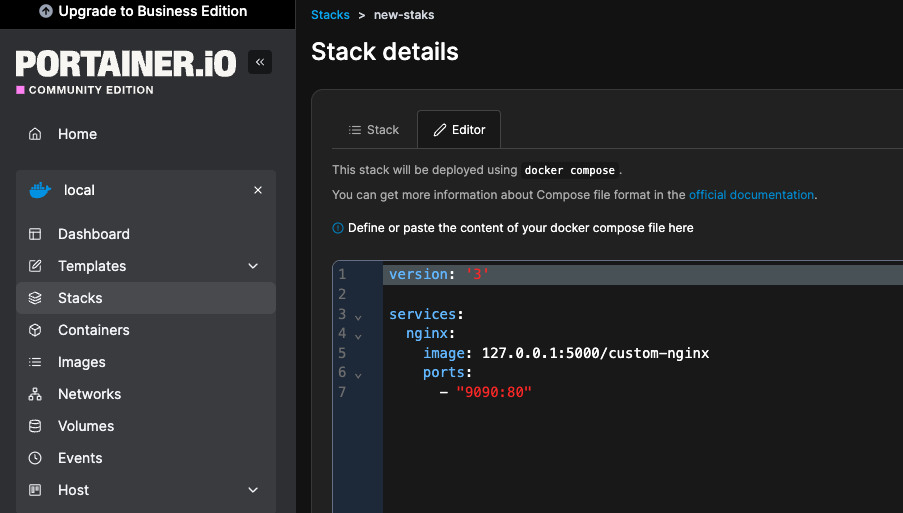
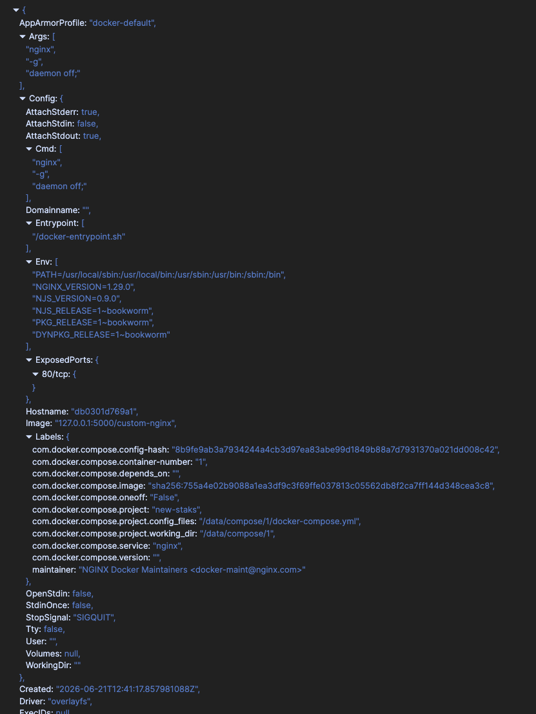
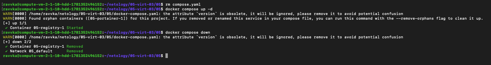

# TASK-1: https://hub.docker.com/repository/docker/ravvka/custom-nginx/general

# TASK-2: 

# TASK-3:
1-3

    3 - командой attach мы зашли в основной поток контейнера. При нажатии Ctrl+C мы его завершили.
        Чтобы избежать такой ситуации необходимо подключаться с аргументом --sig-proxy=false

4-6   

7-9   

10   

- мы перенастроили nginx на прослушивание 81 порта, а сам контейнер запущен на 80 порту

12   

# TASK-4

1-2   

3-5   

# TASK-5
1   

* docker compose может запускать как compose.yaml(yml), так и docker-compose.yaml(yml) (второе для обратной совместимости)
* При наличии обоих файлов предпочтение отдаётся compose.yaml

2   

3   

4-5   

6   

7   

* атрибут `version` устарел и игнорируется
* контейнер `05-portainer-1` не описан в текущей настройке docker-compose.yaml 