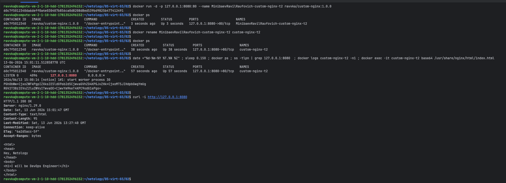
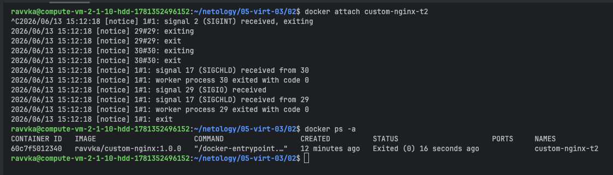
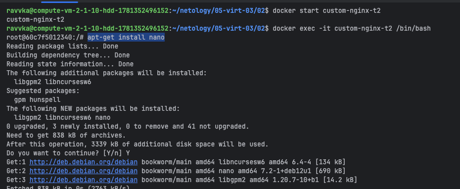
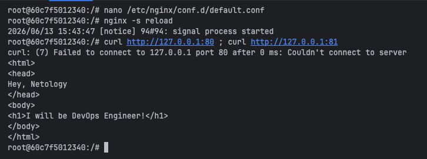
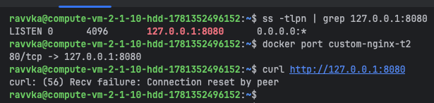
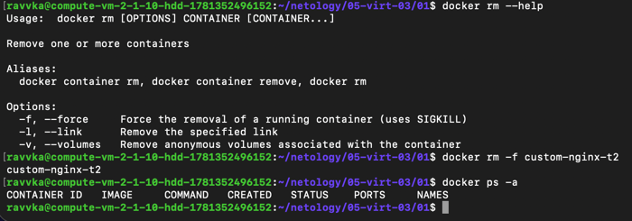
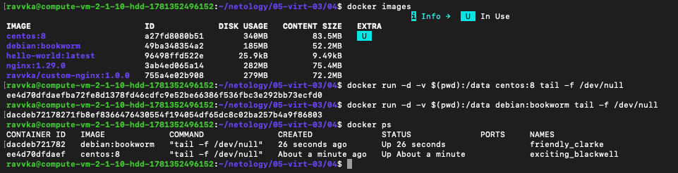
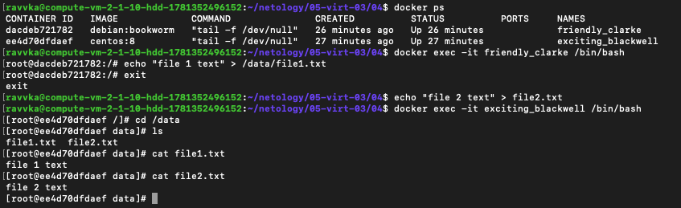

# TASK-1: https://hub.docker.com/repository/docker/ravvka/custom-nginx/general

# TASK-2: 

# TASK-3:
1-3

    3 - командой attach мы зашли в основной поток контейнера. При нажатии Ctrl+C мы его завершили.
        Чтобы избежать такой ситуации необходимо подключаться с аргументом --sig-proxy=false

4-6

7-9  

10  

- мы перенастроили nginx на прослушивание 81 порта, а сам контейнер запущен на 80 порту

12  

# TASK-4

1-2

3-5

# TASK-5
