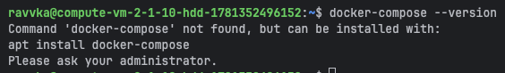
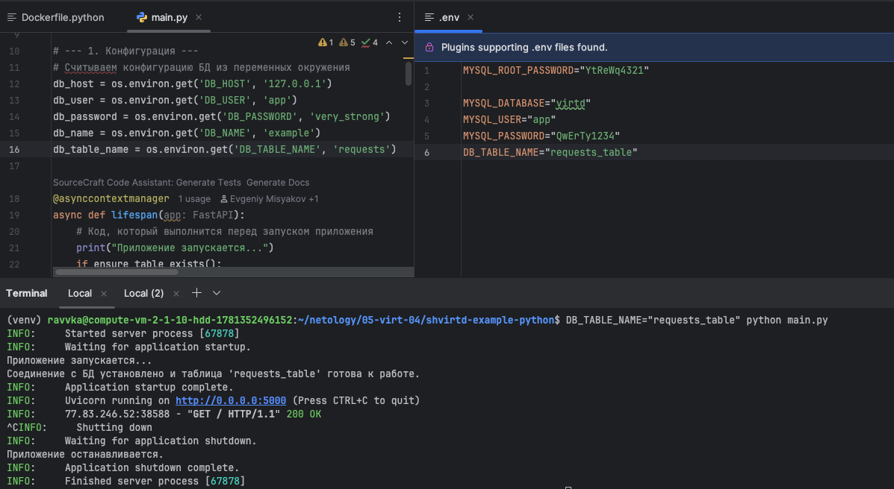
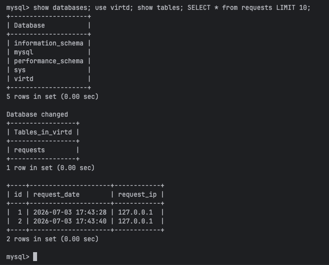

# TASK-0


# TASK-1
1. fork: https://github.com/Ravvka/shvirtd-example-python.git
2. Dockerfile.python:
```commandline
# stage 1
FROM python:3.12-slim AS build

WORKDIR /app

#  Ваш код здесь #
COPY . .
RUN pip install --user --no-cache-dir -r requirements.txt

# stage 2
FROM python:3.12-slim

WORKDIR /app

COPY --from=build /root/.local /root/.local
COPY --from=build /app /app

ENV PATH=/root/.local/bin:$PATH

EXPOSE 5000

# Запускаем приложение с помощью uvicorn, делая его доступным по сети
CMD ["uvicorn", "main:app", "--host", "0.0.0.0", "--port", "5000"] 
```
3. предварительно установил mysql (запуск БД не в контейнере): `python main.py`
4. в main.py изменил имя таблицы на переменную db_table_name = os.environ.get('DB_TABLE_NAME', 'requests')


# TASK-2*

# TASK-3


# TASK-4

